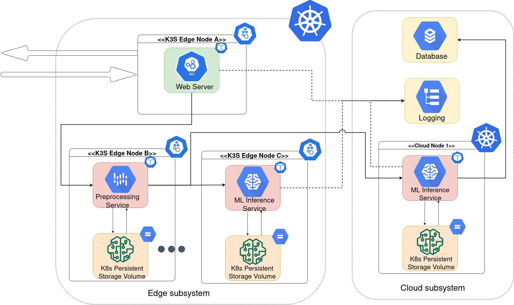

# ML video inference scenario in edge-cloud systems
This collates the configurations and code of units and providers for ML video inference offloading scenario in an edge-cloud infrastructure.

#### Requirements
All the components of this scenario are containarized. To run this simulation, we only need:

* Kubernetes or k3s (They were tested on k3s platform)


#### Structure
```
files
│
└───CloudInferenceUnit/
└───EdgeBrokerProvider/
└───EdgeInferenceUnit/
└───EdgePreprocessorUnit/
└───EdgeWebServerUnit/
└───autoscale.yml
```
__Every unit and provider has a separate Kubernetes manifest in their respective folder. This is the recommended approach to prevent large unmanageable k8s manifests.__

#### Introducing elasticity and offloading
The `autoscale.yml` is the manifest responsible for horizontal elasticity in the scenario. You need to fill in the respective service-name deploy it.

The edge-cloud offloading logic is in the `estimate_to_cloud` method in the [EdgePreprocessorUnit/src/preprocessor.py](EdgePreprocessorUnit/src/preprocessor.py) file.You can edit it to ensure your custom logic of edge-cloud offloading

#### System Overview
The following figure presents a generic view of the ML video inference offloading scenario deployment in edge and cloud infrastructures.



<sup>Image src: [1]</sup>

This is one of strategies to deploy it. The recommended way to pod-node assignment for this scenario in k8s is _scheduling eviction strategy_ [2].


#### External libraries
The following external libraries are used in this scenario:
* (Darknet)[https://github.com/pjreddie] library for video frame inference 
* Tiny yolo pretrained weights from: https://pjreddie.com/media/files/yolov3-tiny.weights
* (Gunicorn)[https://gunicorn.org/] HTTP server and (Eventlet)[https://eventlet.net/] for multiple http async workers 

---

## Note
* It is up to the user to make sure that the configuration file is well defined (e.g. topic names match between ingestionClients and sensors)


---
References
[1] Raj, Rohit. 2021. Establishing trust for secure elasticity in edge-cloud microservices. Master's Thesis. (Submitted to) Aalto University, Finland & Eurecom, France

[2] _Assigning Pods to Nodes_. 2021. https://kubernetes.io/docs/concepts/scheduling-eviction/assign-pod-node/